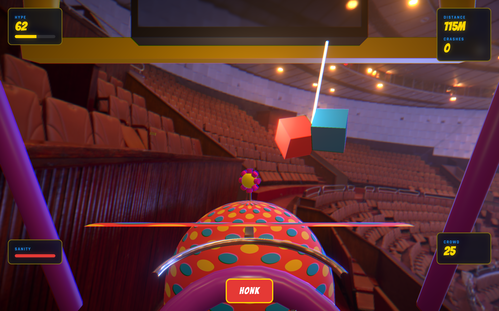
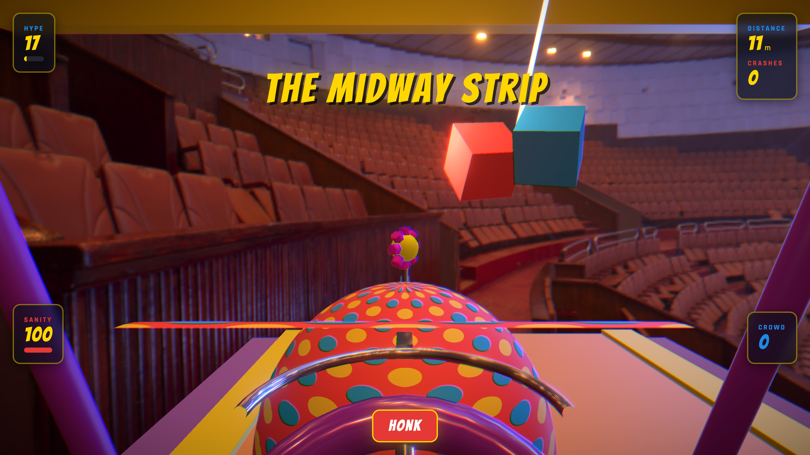
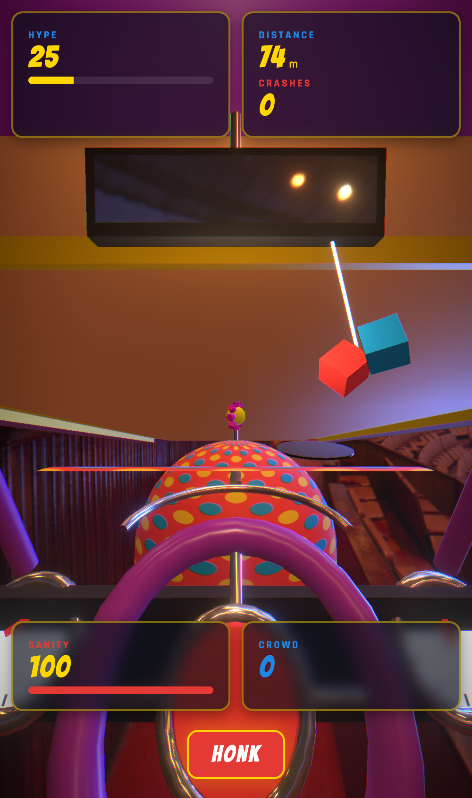
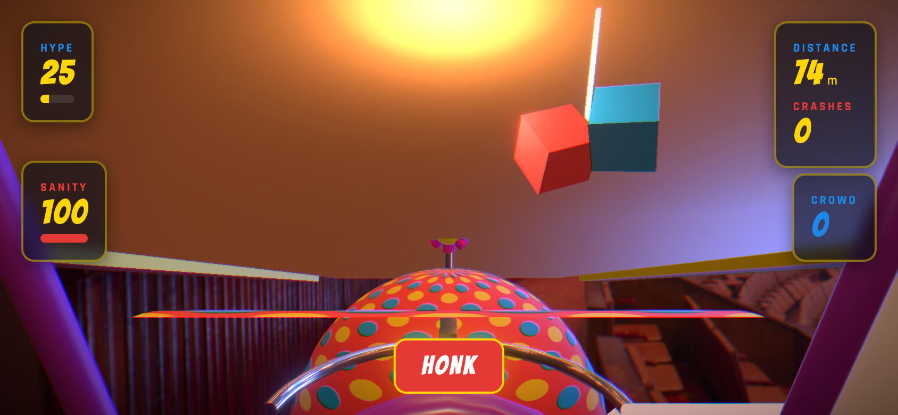
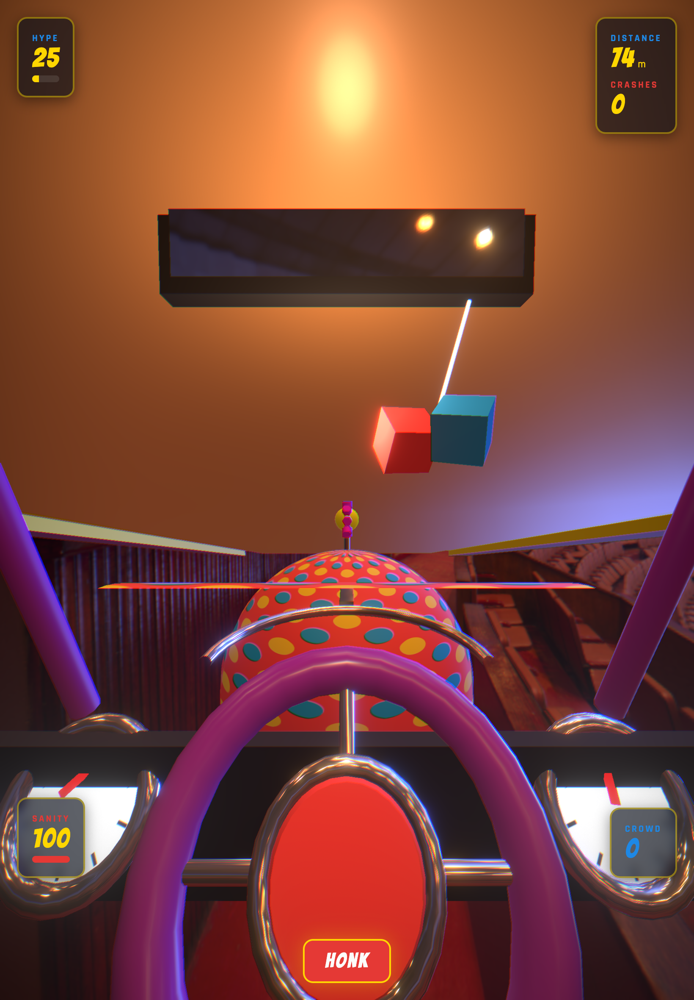

[](https://github.com/arcade-cabinet/midway-mayhem/actions/workflows/ci.yml)
[](https://github.com/arcade-cabinet/midway-mayhem/releases)
[](LICENSE)

# Midway Mayhem: Clown Car Chaos

> **Drive fast. Honk louder.**

Cockpit-perspective arcade driver. You race a polka-dot clown car down a Hot Wheels mega-track inside a circus big-top. Dodge carnival-themed hazards, collect tickets and boosts, and keep the crowd HYPED before your SANITY runs out.



---

## Quick start

```bash
pnpm install       # install deps (requires pnpm 10+)
pnpm dev           # Vite dev server → http://localhost:5173/midway-mayhem/
pnpm test          # node + jsdom tests (fast)
pnpm build         # production web bundle → dist/
```

URL flags (dev + test):

| Flag | Effect |
|------|--------|
| `?skip=1` | Skip title screen, drop into gameplay immediately |
| `?governor=1` | Yuka.js autonomous driver plays the game |
| `?diag=1` | Expose `window.__mm.diag()` for telemetry |

---

## Feature matrix

| Feature | Status |
|---------|--------|
| Cockpit POV camera | Shipped |
| 4 zones (Midway Strip / Balloon Alley / Ring of Fire / Funhouse Frenzy) | Shipped |
| 5 critter/obstacle types + HONK flee mechanic | Shipped |
| Trick system (airborne rotations) | Queued |
| Ringmaster raids (telegraphed hazard events) | Queued |
| Daily route (UTC-seeded track + local leaderboard) | Queued |
| Replay ghost (input-trace of best run) | Queued |
| 20 achievements | Queued |
| Big Top Tour mode | Queued |

---

## Screenshots

| Midway Strip — desktop | Phone portrait |
|------------------------|----------------|
|  |  |

| Phone landscape | Tablet portrait |
|-----------------|-----------------|
|  |  |

---

## Commands

```bash
pnpm dev                # Vite dev server
pnpm build              # production web bundle
pnpm build:native       # Capacitor-targeted bundle (base='./')
pnpm lint               # Biome check
pnpm typecheck          # tsc --noEmit
pnpm test               # node + jsdom (fast)
pnpm test:browser       # real Chromium WebGL tests
pnpm test:e2e           # full Playwright matrix (desktop + mobile)
pnpm capture:marketing  # 12-pose marketing screenshot capture
```

---

## Tech stack

| Layer | Choice |
|-------|--------|
| 3D engine | React Three Fiber 9 + drei 10 |
| Post-processing | @react-three/postprocessing (Bloom, Vignette, CA, Noise) |
| Audio | Tone.js procedural + spessasynth_lib SF2 sampler |
| AI driver | Yuka.js steering behaviors |
| Native | Capacitor 8 (Android + iOS) |
| Persistence | CapacitorSQLite + sql.js + drizzle-orm |
| Validation | zod |
| Build | Vite 6 + TypeScript 6 + pnpm |
| Lint/format | Biome 2 |
| Unit tests | Vitest (node + jsdom + browser) |
| E2E tests | Playwright (desktop + mobile matrix) |
| Native smoke | Maestro |

---

## Keyboard controls

| Key | Action |
|-----|--------|
| `←` / `A` | Steer left |
| `→` / `D` | Steer right |
| `Space` | HONK |
| `H` | HONK (alt) |

On mobile/touch: drag pointer left/right to steer; tap HONK button.

---

## Zones

Each zone cycles every ~450 track-metres, changing obstacles, lighting, and ambient music:

1. **The Midway Strip** — warm amber, carousel waltz, sawhorses + cones
2. **Balloon Alley** — pastel sky, gates require precision threading
3. **Ring of Fire** — deep red, hammer hazards, no forgiveness
4. **Funhouse Frenzy** — strobing neon mirrors, highest obstacle density

---

## Docs

| Doc | Purpose |
|-----|---------|
| [CLAUDE.md](CLAUDE.md) | Agent entry point — critical rules, commands |
| [AGENTS.md](AGENTS.md) | Extended operating protocols + architecture |
| [docs/ARCHITECTURE.md](docs/ARCHITECTURE.md) | Rendering pipeline, data flow, build output |
| [docs/DESIGN.md](docs/DESIGN.md) | Product vision, brand, palette, pillars |
| [docs/TESTING.md](docs/TESTING.md) | 4-tier test pyramid, conventions, coverage |
| [docs/DEPLOYMENT.md](docs/DEPLOYMENT.md) | Web + Android + iOS pipeline |
| [docs/LORE.md](docs/LORE.md) | World, characters, zones, credits |
| [docs/STATE.md](docs/STATE.md) | Current state, known issues, decisions log |
| [docs/ROADMAP.md](docs/ROADMAP.md) | Queued features, execution model |

---

## License

Code: MIT. Assets: Kenney Racing Kit CC0, PolyHaven `circus_arena` HDRI CC0.
See [docs/LORE.md#credits](docs/LORE.md#credits).

---

## Maintainer

https://github.com/arcade-cabinet/midway-mayhem
